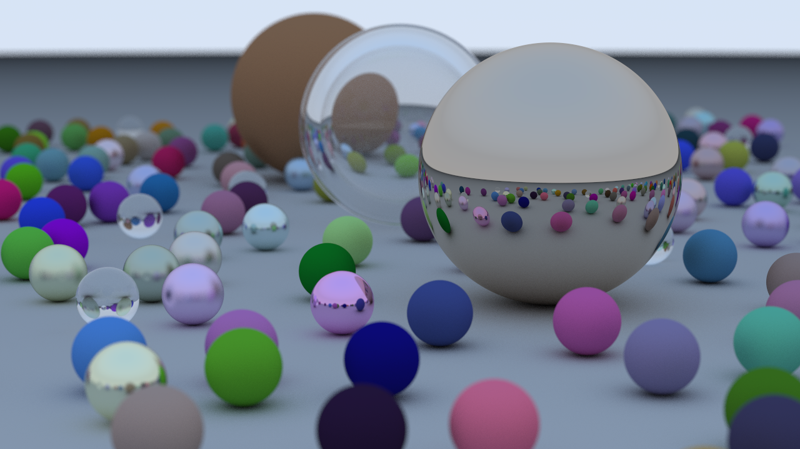
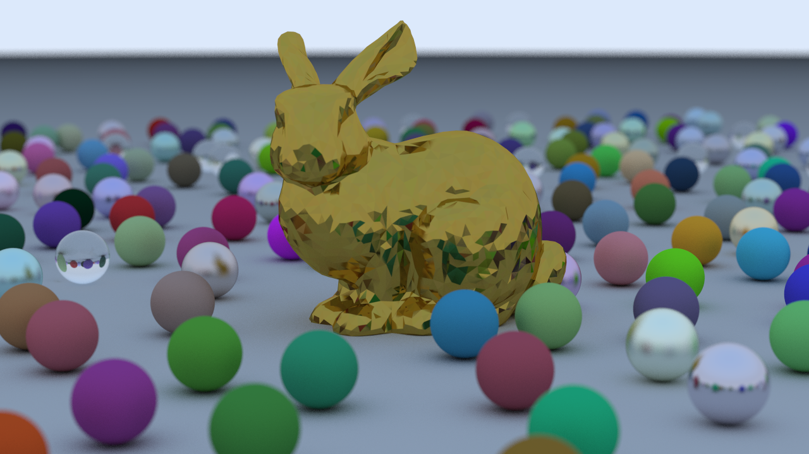
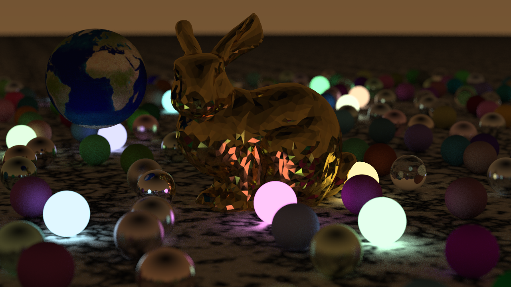
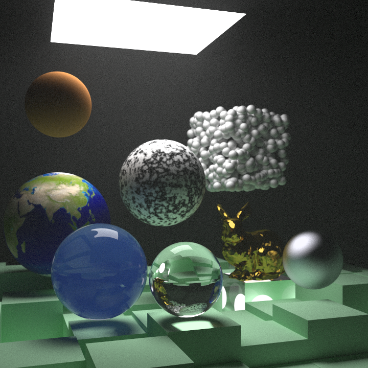
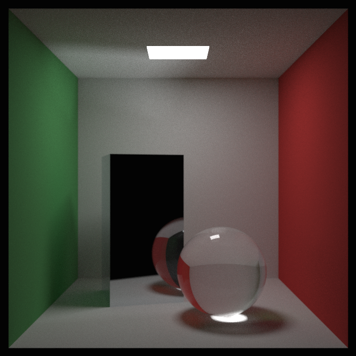

# Ray Tracer

This ray tracer is heavily inspired by [_Ray Tracing in One Weekend_](https://raytracing.github.io/books/RayTracingInOneWeekend.html)

The fast ray/triangle intersection of the following article is used:  
_Doug Baldwin and Michael Weber, Fast Ray-Triangle Intersections by Coordinate Transformation, Journal of Computer Graphics Techniques (JCGT), vol. 5, no. 3, 39-49, 2016, [http://jcgt.org/published/0005/03/03/](http://jcgt.org/published/0005/03/03/)_

<!--  -->

Here is the final scene of [_Ray Tracing: The Next Week_](https://raytracing.github.io/books/RayTracingTheNextWeek.html):

Finnaly, here is a Cornell Box from [_Ray Tracing: The Rest of Your Life_](https://raytracing.github.io/books/RayTracingTheRestOfYourLife.html) rendered with some importance sampling:

